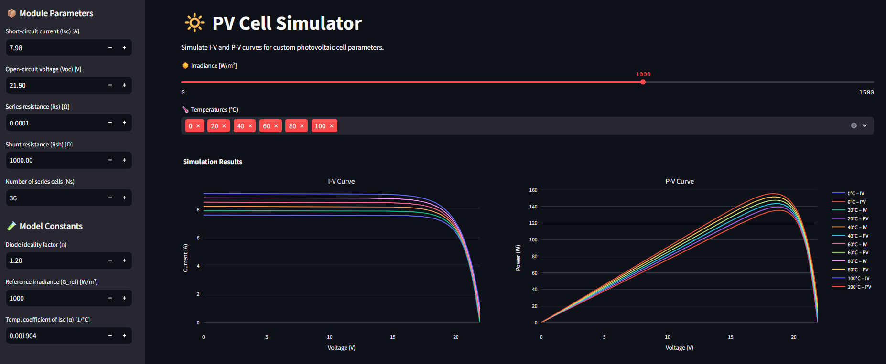

# ☀️ PV Cell Simulator – Streamlit App

Simulate the behavior of a **photovoltaic (PV) cell** interactively with full control over physical and electrical parameters.

This app allows you to:
- 🔧 Customize diode model parameters (Rs, Rsh, Voc, Isc, n, etc.)
- 🌤 Adjust irradiance and simulate temperature ranges
- 📈 View I-V and P-V curves in real-time
- 📸 Export plots as PNG
- 📄 Generate a PDF simulation report
- 💾 Download simulation data as CSV

---

## 🚀 Demo



---

## 📦 Features

- 🌡 Simulates multiple temperatures at once (0 °C to 100 °C)
- 📐 Adjustable irradiance (0–1500 W/m²)
- ⚙️ Custom input for all model parameters
- 📊 Interactive I-V and P-V plots (Plotly)
- 📸 Export plots as PNG

---

## 🛠 Installation

### 1. Clone the repository

```
git clone [https://github.com/yourusername/pv-cell-simulator.git](https://github.com/vitordmarchiori/PVCellSimulator.git)
cd PVCellSimulator
```

### 2. Install dependencies
```
pip install streamlit plotly pandas kaleido pdfkit
```

## ▶️ Run the App

1. Open a terminal or command prompt.
2. Navigate to the folder where this file is located using:
    cd "path\to\your\folder"
    (For example: cd "C:\Users\YourUsername\Documents\PVCellSimulator")

3. Run the app with Streamlit:
    streamlit run PV_App.py

Alternatively, provide the full path directly:
    streamlit run "C:\full\path\to\PVCellSimulator.py"

---

## 📄 Requirements

```
streamlit
plotly
pandas
kaleido
pdfkit
```

---

## 🧠 Based on:

Dhruv Berwal and Monika Kaushik (2022)
*Modelling and Simulation of Photovoltaic Cell in MATLAB*
[Original paper PDF](https://doi.org/10.53550/EEC.2022.v28i08s.006)

---

## 📜 License

This project is licensed under the MIT License.
Feel free to use, share, and contribute!

---

## 🙌 Contributing

Pull requests are welcome!
If you have suggestions, improvements, or new ideas, feel free to open an issue or fork the repo.
